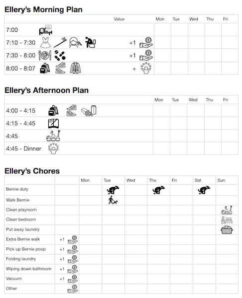

# Kid Chores

Our montessori kids need a way to plan their day, and we are a bit intense about our family schedule. So, we brainstormed a chart that takes care of before school and after school responsibilities for our kids.

Today, it's a pages document which does not make this easy to see on GitHub, but here it is if anyone wants to copy or make it better!

[Download the Chart](https://github.com/andrewbredow/kid-chores/raw/master/chart.pages)

## Icon Descriptions

- Bed - wake up
- Dress - get dressd
- Toothbrush - brush your teeth
- Hair/brush - brush your hair
- Person on toilet - 💩
- Plate - eat broakfast
- Pills - take your medicine / vitamin
- Backpack - pack / unpack your schoolbag
- Shoes - put on / put away your shoes
- Coat - put on / put away your coat
- Book - homework
- Toys - Clean / tidy your playroom
- Person juggling - Earn / use your friend/tv/screen/ipad time
- Hand with money - Earn a point (how we handle allowance)
- Dog pooping - You're responsible for taking the dog out when he needs to go
- Dog walking - Take the dog for a walk
- Bedroom - Clean / tidy your room
- Basket - Put away your folded clonthes

## Credits

- THe icons were all taken from [The Noun Project](https://thenounproject.com/)
